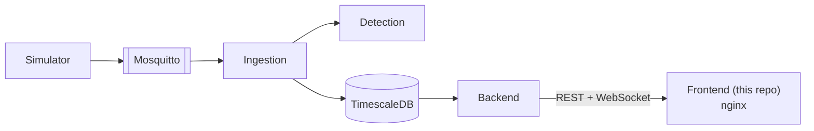
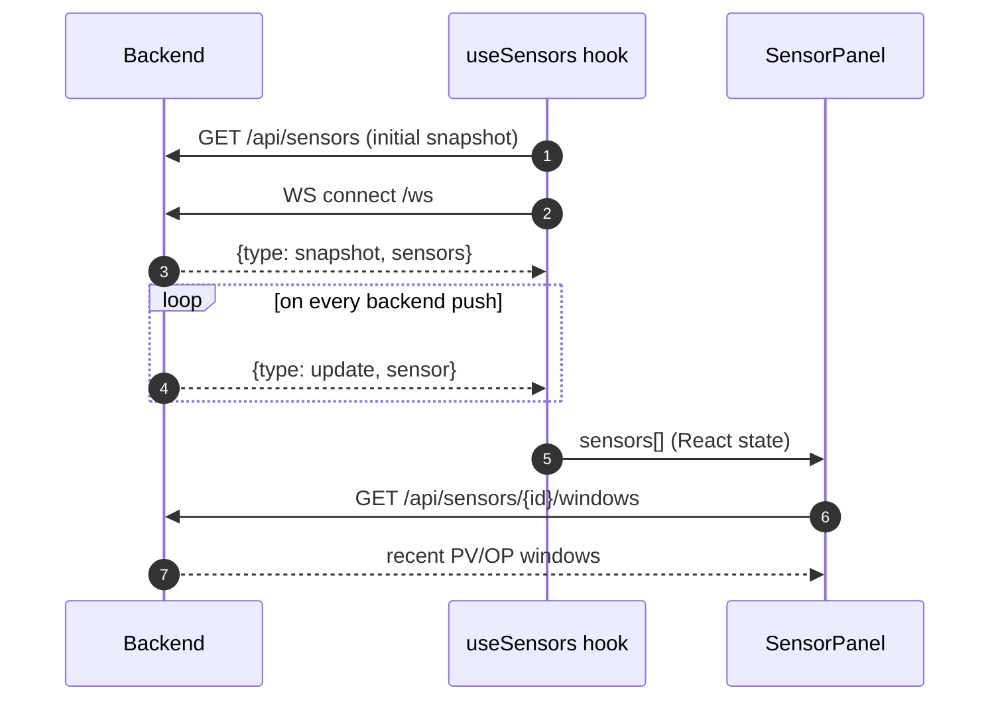

# valve-stiction-frontend

[](https://github.com/maulanaiskak/valve-stiction-frontend/actions)

Dashboard for a distributed, real-time control-valve stiction detection pipeline. React + TypeScript (Vite). Talks to [valve-stiction-backend](https://github.com/maulanaiskak/valve-stiction-backend)'s REST API and WebSocket for live data — no other backend integration.

**Part of a 5-repo system** — see [System Design (HLD)](https://github.com/maulanaiskak/valve-stiction-backend/blob/main/docs/HLD.md) and [Whitepaper](https://github.com/maulanaiskak/valve-stiction-backend/blob/main/docs/WHITEPAPER.md) for the full picture: a train/serve model-generalization failure found, fixed, and honestly bounded; a monolith split into 5 independently-deployable services; 99.6%/AUC 0.9998 live-streaming detection accuracy after the fix.

| Repo | Role |
|---|---|
| [simulator](https://github.com/maulanaiskak/valve-stiction-simulator) | Synthetic PV/OP signal generator |
| [ingestion](https://github.com/maulanaiskak/valve-stiction-ingestion) | MQTT subscribe, windowing, forwards to detection |
| [detection](https://github.com/maulanaiskak/valve-stiction-detection) | Classic detector + trained RF model |
| [backend](https://github.com/maulanaiskak/valve-stiction-backend) | REST + WebSocket API |
| **frontend** (this repo) | React dashboard |

## Where this fits



nginx reverse-proxies `/api` and `/ws` to the backend so the browser sees one origin (no CORS to configure), while the two images stay fully independent builds — this repo's Docker build never touches the backend's source.

## What it shows

Per sensor: a status badge (classic detector + RF model, shown side by side rather than picked between — the system never resolves a disagreement between them silently), an animated valve (smooth travel when healthy, stepped/jerky when sticking — the same flat-then-jump shape the detectors score for), a PV-vs-OP phase plot, and PV/OP-over-time charts.

## Data flow



## Structure

```
src/
  types.ts                  domain types -- mirrors backend/domain/sensor.go's JSON shape exactly
  api.ts                    REST client + WS URL helper
  hooks/useSensors.ts        WebSocket connection + live sensor state
  components/
    SensorPanel.tsx          per-sensor layout: status, valve, phase plot, time series
    StatusBadge.tsx          classic + RF verdict, shown side by side
    ValveAnimation.tsx       CSS-animated valve stem (smooth vs. stepped)
    PhasePlot.tsx            PV-vs-OP scatter (Recharts)
    TimeSeriesChart.tsx      PV/OP-over-time line chart (Recharts)
```

## Run

Dev (Vite proxies `/api` and `/ws` to `http://localhost:8080` — see `vite.config.ts`):

```bash
npm install
npm run dev
```

Production: this repo builds and deploys as its own image, independent of `valve-stiction-backend` — the two never build against each other. `Dockerfile` is a multi-stage build (`npm run build`, then `nginx:alpine` serving the static output):

```bash
docker build -t valve-stiction-frontend .
docker run -p 8081:80 -e BACKEND_HOST=backend:8080 valve-stiction-frontend
```

| Env var | Default |
|---|---|
| `BACKEND_HOST` | `backend:8080` |

## Testing

CI runs `npm run build` (`tsc -b` + `vite build`) as the type/build check — no test suite yet.
